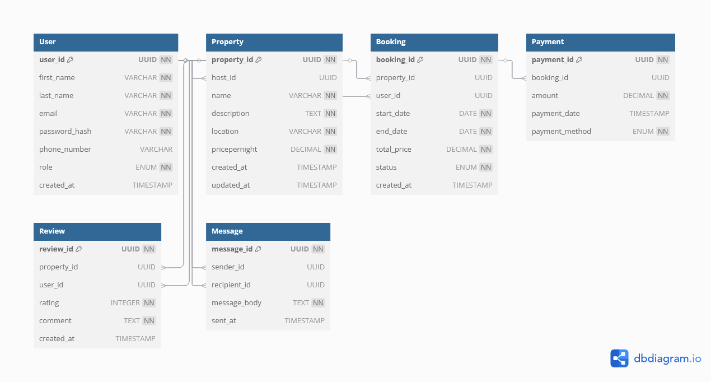

# Airbnb Database ER Diagram

This diagram represents the database schema for the Airbnb-like application.

## Entities:
- User
- Property
- Booking
- Payment
- Review
- Message

## Relationships:
- A User can own many Properties (if host).
- A User can make many Bookings.
- A Property can have many Bookings.
- A Booking has one Payment.
- A User can write many Reviews for Properties.
- A Property can have many Reviews.
- A User can send and receive Messages.

## Diagram:

